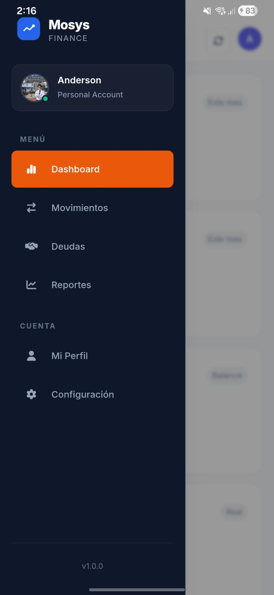
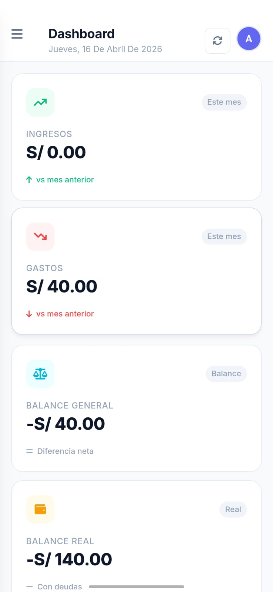
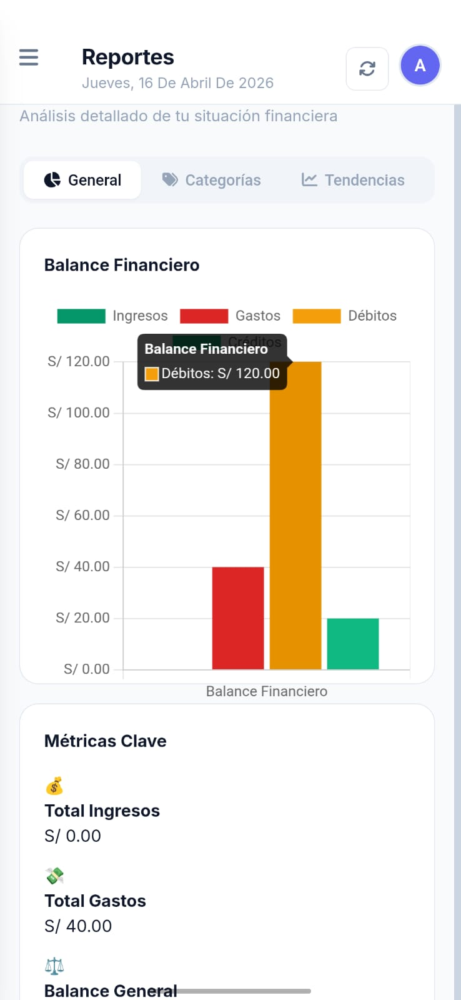
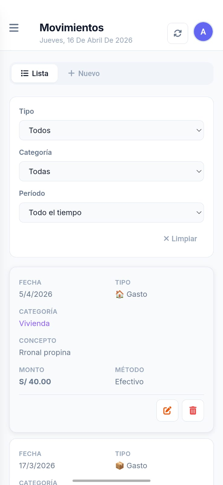
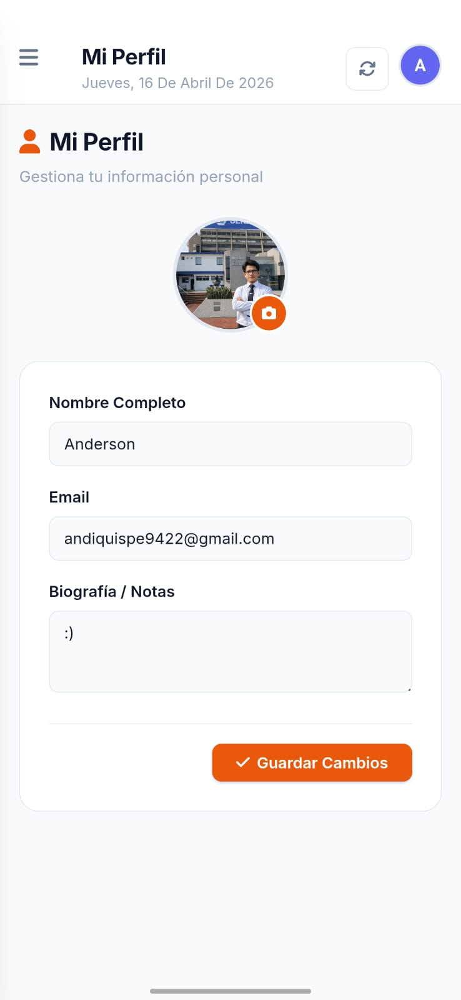
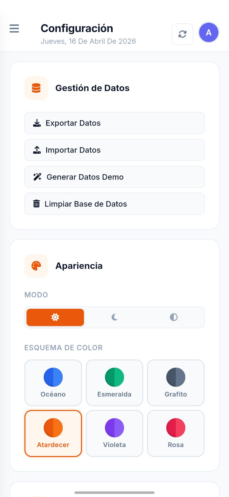

<p align="center">
  
</p>

<h1 align="center">Mosys</h1>
<h4 align="center">Money System · Sistema Económico Personal</h4>

<p align="center">
  
  
  
  
  
</p>

<p align="center">
  Aplicación móvil híbrida para la buena gestión de la economía personal.<br>
  Controla ingresos, gastos y deudas de forma inteligente — todo desde tu bolsillo.
</p>

<p align="center">
  <b>Mosys</b> = <b>Mo</b>ney <b>Sys</b>tem (Sistema Económico Personal)
</p>

---

## 📋 Datos del Proyecto

| Campo                   | Detalle                                                                        |
| ----------------------- | ------------------------------------------------------------------------------ |
| **Institución**         | SENATI — Servicio Nacional de Adiestramiento en Trabajo Industrial             |
| **Programa**            | Desarrollo de Aplicaciones Móviles 2                                           |
| **Tipo de evaluación**  | Examen de Suficiencia Profesional                                              |
| **Alumno**              | Anderson Quispe                                                                |
| **Tema del examen**     | Desarrollar una aplicación móvil con formularios y un módulo CRUD              |
| **Cumplimiento**        | ✅ 100% — La app implementa múltiples formularios y operaciones CRUD completas |
| **Fecha de desarrollo** | Febrero 2026                                                                   |
| **Versión**             | 1.0.0                                                                          |

> **Nota:** El presente proyecto fue desarrollado como trabajo final para el examen de suficiencia del programa de Desarrollo de Aplicaciones Móviles 2 de SENATI. El requerimiento principal era construir una aplicación móvil funcional que incluya formularios de entrada de datos y al menos un módulo con operaciones CRUD (Crear, Leer, Actualizar, Eliminar). Mosys (**Mo**ney **Sys**tem — Sistema Económico Personal) cumple y supera estos requisitos implementando **tres módulos CRUD independientes** (Movimientos, Deudas y Perfil), múltiples formularios con validaciones, y funcionalidades adicionales como reportes, temas personalizables y exportación de datos. La finalidad de la aplicación es contribuir a la **buena gestión de la economía personal** del usuario.

---

## 📑 Índice

- [Descripción General](#-descripción-general)
- [Características](#-características)
- [Módulos CRUD](#-módulos-crud)
- [Formularios](#-formularios)
- [Tecnologías Utilizadas](#️-tecnologías-utilizadas)
- [Arquitectura del Proyecto](#-arquitectura-del-proyecto)
- [Estructura de Archivos](#-estructura-de-archivos)
- [Base de Datos](#️-base-de-datos)
- [Requisitos Previos](#-requisitos-previos)
- [Instalación y Ejecución](#-instalación-y-ejecución)
- [Empaquetado Android (APK)](#-empaquetado-android-apk)
- [Personalización (Temas)](#-personalización-temas)
- [Capturas de Pantalla](#-capturas-de-pantalla)
- [Licencia](#-licencia)
- [Contacto](#-contacto)

---

## 🎯 Descripción General

**Mosys** (acrónimo de **Money System** — Sistema Económico Personal) es una aplicación móvil diseñada para promover la **buena gestión de la economía personal**. En un contexto donde muchas personas no llevan un registro ordenado de sus finanzas, Mosys ofrece una solución accesible, intuitiva y completamente offline para tomar el control del dinero.

### Finalidad

La aplicación busca resolver un problema real y cotidiano: **la falta de organización financiera personal**. Con Mosys, el usuario puede:

- 📝 **Registrar** cada ingreso y gasto con detalle (monto, categoría, método de pago, fecha)
- 📊 **Visualizar** a dónde va su dinero mediante reportes y el dashboard
- 💳 **Controlar** deudas y créditos pendientes con fechas límite
- 📈 **Tomar mejores decisiones** financieras basadas en datos reales
- 💾 **Respaldar** su información exportando la base de datos

La aplicación almacena todos los datos **localmente en el dispositivo** usando SQLite (sql.js), garantizando privacidad total sin necesidad de servidores externos ni conexión a internet. Funciona como **PWA** (Progressive Web App) en navegadores y como **app nativa Android** gracias a Capacitor.

### ¿Por qué Mosys?

- 💰 **Control total** de tu economía personal en un solo lugar
- 📊 **Reportes visuales** para entender tus hábitos de gasto
- 🔒 **Privacidad** — tus datos nunca salen de tu dispositivo
- 📱 **Multiplataforma** — funciona en Android y navegadores web
- 🎨 **Personalizable** — 6 esquemas de color + modo claro/oscuro
- 🌐 **Sin internet** — funciona 100% offline

---

## ✨ Características

### Funcionalidades Principales

| Característica    | Descripción                                                                      |
| ----------------- | -------------------------------------------------------------------------------- |
| **Dashboard**     | Panel principal con resumen de balance, ingresos, gastos y movimientos recientes |
| **Movimientos**   | CRUD completo de ingresos y gastos con categorías, métodos de pago y filtros     |
| **Deudas**        | Gestión de débitos y créditos con seguimiento de estados y fechas límite         |
| **Reportes**      | Análisis financiero con distribución por categorías y exportación de datos       |
| **Perfil**        | Edición de datos personales del usuario                                          |
| **Configuración** | Gestión de datos (export/import/limpiar), apariencia y tema                      |

### Funcionalidades Técnicas

- ✅ Operaciones **CRUD** completas (Create, Read, Update, Delete)
- ✅ **Formularios** con validaciones en tiempo real
- ✅ Base de datos **SQLite** local (sql.js)
- ✅ Diseño **responsive** (mobile-first)
- ✅ **PWA** con Service Worker para uso offline
- ✅ **Capacitor** para empaquetado nativo Android
- ✅ Temas **claro/oscuro/automático** con 6 esquemas de color
- ✅ **Exportación e importación** de base de datos
- ✅ Splash Screen y StatusBar nativos configurados

---

## 🔄 Módulos CRUD

### 1. Módulo de Movimientos (`movimientos.js`)

El módulo principal de la aplicación. Permite registrar y administrar todos los ingresos y gastos.

| Operación  | Implementación                                                                              |
| ---------- | ------------------------------------------------------------------------------------------- |
| **Create** | Formulario con campos: tipo, monto, categoría, concepto, descripción, método de pago, fecha |
| **Read**   | Tabla/listado con filtros por tipo, categoría, fecha. Vista responsive (cards en móvil)     |
| **Update** | Modal de edición que precarga los datos del registro seleccionado                           |
| **Delete** | Confirmación antes de eliminar con modal de diálogo                                         |

**Archivo:** `js/movimientos.js` (934 líneas)

### 2. Módulo de Deudas (`deudas.js`)

Gestión de dinero prestado y adeudado con control de estados.

| Operación  | Implementación                                                             |
| ---------- | -------------------------------------------------------------------------- |
| **Create** | Formulario: tipo (débito/crédito), persona, monto, concepto, fechas, notas |
| **Read**   | Listado con filtros por tipo y estado (Pendiente, Pagado, Vencido)         |
| **Update** | Edición completa + cambio de estado rápido                                 |
| **Delete** | Eliminación con confirmación                                               |

**Archivo:** `js/deudas.js` (370 líneas)

### 3. Módulo de Perfil

Gestión del perfil de usuario con operaciones de lectura y actualización.

| Operación  | Implementación                                           |
| ---------- | -------------------------------------------------------- |
| **Read**   | Visualización de datos del perfil desde la base de datos |
| **Update** | Formulario de edición de nombre, email y avatar          |

---

## 📝 Formularios

La aplicación implementa los siguientes formularios con validaciones:

### Formulario de Nuevo Movimiento

```
┌─────────────────────────────────────┐
│  Tipo:        [Ingreso ▼] / [Gasto]│
│  Monto:       [S/ ___________]     │
│  Categoría:   [Seleccionar ▼]      │
│  Concepto:    [_______________]     │
│  Descripción: [_______________]     │
│  Método pago: [Efectivo ▼]         │
│  Fecha:       [dd/mm/yyyy]         │
│                                     │
│  [Cancelar]  [Guardar Movimiento]  │
└─────────────────────────────────────┘
```

### Formulario de Nueva Deuda

```
┌─────────────────────────────────────┐
│  Tipo:         [Débito] / [Crédito]│
│  Persona:      [_______________]   │
│  Monto:        [S/ __________]     │
│  Concepto:     [_______________]   │
│  Fecha inicio: [dd/mm/yyyy]        │
│  Fecha límite: [dd/mm/yyyy]        │
│  Notas:        [_______________]   │
│                                     │
│  [Cancelar]    [Guardar Deuda]     │
└─────────────────────────────────────┘
```

### Formulario de Perfil

```
┌─────────────────────────────────────┐
│  Nombre:  [_______________]        │
│  Email:   [_______________]        │
│  Avatar:  [URL imagen]             │
│                                     │
│  [Guardar Cambios]                 │
└─────────────────────────────────────┘
```

### Validaciones Implementadas

- Campos obligatorios marcados visualmente
- Validación de montos (solo números positivos)
- Validación de fechas
- Restricciones `CHECK` a nivel de base de datos
- Feedback visual con toasts de éxito/error

---

## 🛠️ Tecnologías Utilizadas

| Tecnología                   | Versión | Propósito                                   |
| ---------------------------- | ------- | ------------------------------------------- |
| **HTML5**                    | —       | Estructura de la aplicación (SPA)           |
| **CSS3**                     | —       | Diseño responsive, variables CSS, dark mode |
| **JavaScript** (ES6+)        | —       | Lógica de negocio, manipulación DOM         |
| **sql.js**                   | CDN     | Motor SQLite compilado a WebAssembly        |
| **Capacitor**                | 8.0.2   | Empaquetado nativo Android                  |
| **@capacitor/status-bar**    | 8.0.0   | Control de barra de estado Android          |
| **@capacitor/splash-screen** | 8.0.0   | Pantalla de carga nativa                    |
| **Font Awesome**             | 6.x     | Iconografía                                 |
| **Google Fonts (Inter)**     | 300–800 | Tipografía principal                        |
| **Service Worker**           | —       | Funcionalidad offline (PWA)                 |

---

## 🏗 Arquitectura del Proyecto

```
┌─────────────────────────────────────────────────────┐
│                    VISTA (HTML/CSS)                  │
│  index.html — SPA con 6 secciones                   │
│  css/styles.css — Design System completo             │
├─────────────────────────────────────────────────────┤
│                 CONTROLADOR (JS)                     │
│  js/app.js ─── Controlador principal (MosysApp)     │
│  js/movimientos.js ─── CRUD Movimientos             │
│  js/deudas.js ─── CRUD Deudas                       │
│  js/reportes.js ─── Generación de reportes          │
├─────────────────────────────────────────────────────┤
│                   MODELO (DB)                        │
│  js/db.js ─── DatabaseManager (SQLite via sql.js)   │
│  └── movimientos | deudas | categorias | config     │
├─────────────────────────────────────────────────────┤
│              CAPA NATIVA (Capacitor)                 │
│  capacitor.config.json                               │
│  android/ ─── Proyecto Android Studio                │
│  └── StatusBar | SplashScreen                        │
└─────────────────────────────────────────────────────┘
```

La aplicación sigue un patrón **MVC simplificado**:

- **Modelo:** `db.js` — Gestiona SQLite, tablas y consultas
- **Vista:** `index.html` + `styles.css` — Interfaz de usuario completa
- **Controlador:** `app.js`, `movimientos.js`, `deudas.js`, `reportes.js` — Lógica de negocio

---

## 📁 Estructura de Archivos

```
Mosys/
│
├── index.html                 # Aplicación principal (SPA)
├── icon.png                   # Ícono original de la app (360×360)
├── manifest.json              # Manifest PWA
├── sw.js                      # Service Worker (offline)
├── capacitor.config.json      # Configuración Capacitor
├── package.json               # Dependencias y scripts npm
├── build-apk.sh               # Script automatizado de build APK
├── start_server.sh            # Servidor local de desarrollo
├── README.md                  # Esta documentación
│
├── css/
│   └── styles.css             # Design System completo (~2475 líneas)
│
├── js/
│   ├── app.js                 # Controlador principal MosysApp (1108 líneas)
│   ├── db.js                  # DatabaseManager SQLite (677 líneas)
│   ├── movimientos.js         # CRUD de movimientos (934 líneas)
│   ├── deudas.js              # CRUD de deudas (370 líneas)
│   └── reportes.js            # Generación de reportes (566 líneas)
│
├── assets/
│   ├── icon-72.png            # Íconos PWA en múltiples resoluciones
│   ├── icon-96.png
│   ├── icon-128.png
│   ├── icon-144.png
│   ├── icon-152.png
│   ├── icon-192.png
│   ├── icon-384.png
│   └── icon-512.png
│
├── android/                   # Proyecto nativo Android (Capacitor)
│   ├── app/
│   │   ├── src/main/
│   │   │   ├── assets/public/  # Web assets copiados
│   │   │   ├── res/            # Recursos Android (íconos, splash)
│   │   │   └── AndroidManifest.xml
│   │   └── build.gradle
│   ├── gradle/
│   └── build.gradle
│
└── www/                       # Build de producción (generado)
```

---

## 🗄️ Base de Datos

La aplicación usa **SQLite** ejecutado en el navegador mediante **sql.js** (WebAssembly). Los datos se persisten en `localStorage`.

### Diagrama de Tablas

```
┌──────────────────────┐     ┌──────────────────────┐
│     movimientos      │     │       deudas         │
├──────────────────────┤     ├──────────────────────┤
│ id          INTEGER PK│     │ id          INTEGER PK│
│ tipo        TEXT      │     │ tipo        TEXT      │
│ monto       REAL      │     │ persona     TEXT      │
│ categoria   TEXT      │     │ monto       REAL      │
│ concepto    TEXT      │     │ concepto    TEXT      │
│ descripcion TEXT      │     │ fecha_inicio TEXT     │
│ metodo_pago TEXT      │     │ fecha_limite TEXT     │
│ fecha       TEXT      │     │ estado      TEXT      │
│ created_at  TEXT      │     │ notas       TEXT      │
│ updated_at  TEXT      │     │ created_at  TEXT      │
└──────────────────────┘     │ updated_at  TEXT      │
                              └──────────────────────┘
┌──────────────────────┐     ┌──────────────────────┐
│     categorias       │     │   configuraciones    │
├──────────────────────┤     ├──────────────────────┤
│ id      INTEGER PK   │     │ id    INTEGER PK     │
│ nombre  TEXT UNIQUE   │     │ clave TEXT UNIQUE    │
│ tipo    TEXT          │     │ valor TEXT           │
│ icono   TEXT          │     └──────────────────────┘
│ color   TEXT          │     ┌──────────────────────┐
│ activa  INTEGER       │     │    user_profile      │
└──────────────────────┘     ├──────────────────────┤
                              │ id     INTEGER PK    │
                              │ nombre TEXT          │
                              │ email  TEXT          │
                              │ avatar TEXT          │
                              └──────────────────────┘
```

### Categorías Predefinidas (16)

| Categoría       | Tipo    | Ícono |
| --------------- | ------- | ----- |
| Salario         | Ingreso | 💼    |
| Freelance       | Ingreso | 💻    |
| Ventas          | Ingreso | 🏷️    |
| Inversiones     | Ingreso | 📈    |
| Otros Ingresos  | Ingreso | 💰    |
| Alimentación    | Gasto   | 🍔    |
| Transporte      | Gasto   | 🚗    |
| Vivienda        | Gasto   | 🏠    |
| Servicios       | Gasto   | ⚡    |
| Salud           | Gasto   | 🏥    |
| Educación       | Gasto   | 📚    |
| Entretenimiento | Gasto   | 🎬    |
| Ropa            | Gasto   | 👕    |
| Tecnología      | Gasto   | 📱    |
| Mascotas        | Gasto   | 🐾    |
| Otros Gastos    | Gasto   | 📦    |

---

## 📦 Requisitos Previos

### Para desarrollo web (PWA)

- Navegador moderno (Chrome, Firefox, Edge)
- Servidor HTTP local (Python, Node.js, Live Server, etc.)

### Para empaquetado Android

| Requisito               | Versión mínima      |
| ----------------------- | ------------------- |
| **Node.js**             | 18+                 |
| **npm**                 | 9+                  |
| **Java JDK**            | 21                  |
| **Android SDK**         | API 35 (Android 15) |
| **Android Build Tools** | 35.0.0              |

---

## 🚀 Instalación y Ejecución

### 1. Clonar el repositorio

```bash
git clone https://github.com/Andiquis/Mosys.git
cd Mosys
```

### 2. Instalar dependencias

```bash
npm install
```

### 3. Ejecutar en navegador (desarrollo)

```bash
# Opción A: Script incluido
bash start_server.sh

# Opción B: Python
python3 -m http.server 8000

# Opción C: VS Code Live Server
# Click derecho en index.html → "Open with Live Server"
```

Abrir `http://localhost:8000` en el navegador.

### 4. Ejecutar en dispositivo Android

```bash
# Build + sync + ejecutar en dispositivo conectado
npm run cap:run:android
```

---

## 📲 Empaquetado Android (APK)

### Método 1: Script automatizado

```bash
# Ejecutar el script que configura todo automáticamente
bash build-apk.sh
```

El script realiza:

1. ✅ Verifica Java JDK 21
2. ✅ Descarga Android SDK (si no existe)
3. ✅ Acepta licencias automáticamente
4. ✅ Instala platform-tools y build-tools
5. ✅ Ejecuta `npm run build` + `npx cap sync`
6. ✅ Compila con Gradle (`assembleDebug`)
7. ✅ Instala en dispositivo conectado via ADB

### Método 2: Manual paso a paso

```bash
# 1. Build de assets web
npm run build

# 2. Sincronizar con proyecto Android
npx cap sync android

# 3. Compilar APK
cd android
./gradlew assembleDebug

# 4. El APK se genera en:
# android/app/build/outputs/apk/debug/app-debug.apk

# 5. Instalar en dispositivo conectado
adb install -r app/build/outputs/apk/debug/app-debug.apk
```

### Método 3: Android Studio

```bash
# Abrir proyecto en Android Studio
npx cap open android

# Luego: Run → Run 'app' (o Shift+F10)
```

### Configuración del APK

| Propiedad       | Valor                |
| --------------- | -------------------- |
| **App ID**      | `com.andiquis.mosys` |
| **App Name**    | Mosys                |
| **Min SDK**     | 23 (Android 6.0)     |
| **Target SDK**  | 35 (Android 15)      |
| **Compile SDK** | 35                   |
| **Tamaño APK**  | ~4 MB                |

---

## 🎨 Personalización (Temas)

Mosys incluye un sistema de temas con **3 modos** y **6 esquemas de color**.

### Modos

| Modo          | Descripción                                      |
| ------------- | ------------------------------------------------ |
| ☀️ **Claro**  | Fondo blanco, texto oscuro                       |
| 🌙 **Oscuro** | Fondo slate oscuro, texto claro                  |
| 🔄 **Auto**   | Se adapta a la preferencia del sistema operativo |

### Esquemas de Color

| Esquema          | Color principal | Preview                        |
| ---------------- | --------------- | ------------------------------ |
| 🌊 **Océano**    | `#2563eb`       | Azul profesional (por defecto) |
| 💎 **Esmeralda** | `#059669`       | Verde esmeralda                |
| 🪨 **Grafito**   | `#475569`       | Gris elegante                  |
| 🌅 **Atardecer** | `#ea580c`       | Naranja cálido                 |
| 💜 **Violeta**   | `#7c3aed`       | Púrpura vibrante               |
| 🌹 **Rosa**      | `#e11d48`       | Rosa intenso                   |

Accesible desde: **Configuración → Apariencia**

---

## 📸 Capturas de Pantalla

> Las capturas de pantalla pueden agregarse en la carpeta `assets/` y referenciarse aquí.

| Dashboard                   | Movimientos               | Deudas            |
| --------------------------- | ------------------------- | ----------------- |
| Panel principal con balance | Listado y formulario CRUD | Gestión de deudas |

| Reportes            | Configuración | Acerca de      |
| ------------------- | ------------- | -------------- |
| Análisis financiero | Temas y datos | Info de la app |

---

## 📷 Capturas de Pantalla

A continuación, se muestran algunas capturas de pantalla representativas de la aplicación:

<p align="center" style="display: flex; flex-wrap: wrap; justify-content: center; gap: 10px;">
  
  
  
  
  
  
</p>

---

## 📄 Licencia

Este proyecto está bajo la licencia **MIT**.

```
MIT License

Copyright (c) 2026 Anderson Quispe (Andiquis)

Permission is hereby granted, free of charge, to any person obtaining a copy
of this software and associated documentation files (the "Software"), to deal
in the Software without restriction, including without limitation the rights
to use, copy, modify, merge, publish, distribute, sublicense, and/or sell
copies of the Software...
```

---

## 📬 Contacto

| Canal        | Enlace                                   |
| ------------ | ---------------------------------------- |
| **GitHub**   | [@Andiquis](https://github.com/Andiquis) |
| **Teléfono** | [942 287 756](tel:+51942287756)          |

---

<p align="center">
  <sub>Hecho con ❤️ por <strong>Anderson Quispe</strong> · SENATI 2026</sub><br>
  <sub>Examen de Suficiencia · Desarrollo de Aplicaciones Móviles 2</sub>
</p>
