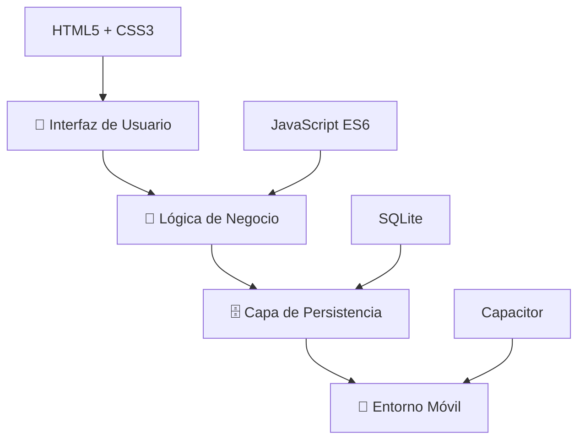
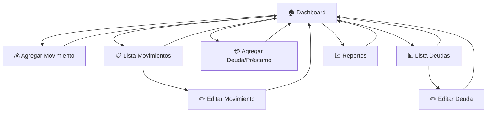

# 📱 MOSYS - Sistema de Dinero Personal

<div align="center">


[](https://github.com/Andiquis)
[](https://github.com/Andiquis)

_Aplicación móvil para gestión inteligente de finanzas personales_

---

</div>

## � Tabla de Contenidos

- [�📌 Descripción General](#-descripción-general)
- [🎯 Objetivos del Sistema](#-objetivos-del-sistema)
- [🧠 Justificación](#-justificación)
- [🏗️ Arquitectura](#️-arquitectura)
- [🧩 Módulos del Sistema](#-módulos-del-sistema)
- [🗄️ Base de Datos](#️-base-de-datos)
- [🔄 Operaciones CRUD](#-operaciones-crud)
- [📱 Flujo de Pantallas](#-flujo-de-pantallas)
- [⚙️ Tecnologías](#️-tecnologías)
- [🚀 Características](#-características)
- [📊 Resultado Esperado](#-resultado-esperado)
- [🧠 Conclusión](#-conclusión)

---

## 📌 Descripción General

> **MOSYS** es una aplicación móvil desarrollada con tecnologías web modernas (HTML5, CSS3, JavaScript ES6) y empaquetada con **Capacitor** para crear una experiencia nativa multiplataforma.

### 🎯 **Propósito Principal**

Centralizar y simplificar la gestión financiera personal a través de un sistema intuitivo que permita el control total de:

- 💰 **Ingresos** - Seguimiento de todas las entradas de dinero
- 💸 **Gastos** - Control detallado de egresos
- 🔴 **Débitos** - Gestión de deudas pendientes
- 🟢 **Créditos** - Administración de dinero por cobrar

### 🏆 **Valor Agregado**

- 📱 Funcionamiento **offline** completo
- 🗄️ Persistencia robusta con **SQLite**
- 📊 Reportes automáticos e inteligentes
- 🔄 Operaciones CRUD completas
- 🎨 Interfaz intuitiva y responsive

---

## 🎯 Objetivos del Sistema

<details>
<summary><strong>🎯 Objetivos Principales</strong></summary>

### 🚀 **Funcionales**

- ✅ Implementar operaciones CRUD para movimientos financieros
- ✅ Desarrollar sistema de gestión de deudas y préstamos
- ✅ Generar reportes automáticos e inteligentes
- ✅ Calcular balance financiero en tiempo real
- ✅ Garantizar persistencia local con SQLite

### 🛠️ **Técnicos**

- ✅ Arquitectura modular y escalable
- ✅ Interfaz responsive y user-friendly
- ✅ Funcionamiento offline completo
- ✅ Optimización de rendimiento móvil

</details>

---

## 🧠 Justificación

### 📊 **Problemática Identificada**

> Muchas personas carecen de control sobre sus finanzas personales debido a la ausencia de herramientas simples y accesibles.

### 💡 **Solución Propuesta**

| **Problema**                       | **Solución MOSYS**                  |
| ---------------------------------- | ----------------------------------- |
| 🔍 Falta de visibilidad financiera | Dashboard con resúmenes automáticos |
| 📝 Control manual de gastos        | Registro digital categorizado       |
| 💭 Olvido de deudas                | Sistema automatizado de seguimiento |
| 📊 Análisis complejo               | Reportes inteligentes automáticos   |
| 🌐 Dependencia de internet         | Funcionamiento 100% offline         |

### 🎯 **Beneficios Clave**

- 🔒 **Privacidad**: Datos almacenados localmente
- ⚡ **Velocidad**: Sin dependencias de red
- 🎯 **Precisión**: Cálculos automáticos y confiables
- 📱 **Accesibilidad**: Disponible en cualquier momento

---

## 🏗️ Arquitectura

### 🏛️ **Diseño Modular en Capas**



| **Capa**            | **Tecnología** | **Función**                        |
| ------------------- | -------------- | ---------------------------------- |
| 🎨 **Presentación** | HTML5 + CSS3   | Interfaces responsives y modernas  |
| 🧠 **Lógica**       | JavaScript ES6 | Reglas de negocio y validaciones   |
| 🗄️ **Persistencia** | SQLite         | Base de datos local robusta        |
| 📱 **Plataforma**   | Capacitor      | Empaquetado nativo multiplataforma |

---

## 🧩 Módulos del Sistema

### 💰 **Módulo de Movimientos Financieros**

<details>
<summary><strong>📊 Ver detalles del módulo</strong></summary>

#### 🎯 **Funcionalidad Principal**

Registro y gestión completa de ingresos y gastos del usuario.

#### 📝 **Formulario de Registro**

| Campo                 | Tipo     | Descripción                            |
| --------------------- | -------- | -------------------------------------- |
| 🔄 **Tipo**           | Select   | Ingreso / Gasto                        |
| 💵 **Monto**          | Number   | Cantidad monetaria                     |
| 📂 **Categoría**      | Select   | Clasificación del movimiento           |
| 📋 **Concepto**       | Text     | Descripción breve                      |
| 📄 **Descripción**    | Textarea | Detalles adicionales (opcional)        |
| 💳 **Método de Pago** | Select   | Efectivo, Tarjeta, Transferencia, etc. |
| 📅 **Fecha**          | Date     | Automática (editable)                  |

#### ⚙️ **Operaciones CRUD**

- ✅ **CREATE**: Nuevo movimiento financiero
- 📖 **READ**: Listado con filtros y búsqueda
- ✏️ **UPDATE**: Edición de registros existentes
- 🗑️ **DELETE**: Eliminación con confirmación

</details>

### 🔄 **Módulo de Débitos y Créditos**

<details>
<summary><strong>💳 Ver detalles del módulo</strong></summary>

#### 🎯 **Concepto Clave**

| Tipo           | Significado                           | Icono |
| -------------- | ------------------------------------- | ----- |
| 🔴 **Débito**  | Dinero que el usuario debe a terceros | ⬇️    |
| 🟢 **Crédito** | Dinero que terceros deben al usuario  | ⬆️    |

#### 📝 **Estructura de Datos**

| Campo                  | Tipo     | Descripción                  |
| ---------------------- | -------- | ---------------------------- |
| 🏷️ **Tipo**            | Select   | Débito / Crédito             |
| 👤 **Persona/Entidad** | Text     | Acreedor o deudor            |
| 💰 **Monto**           | Number   | Cantidad adeudada            |
| 📋 **Concepto**        | Text     | Motivo de la deuda           |
| 📅 **Fecha Inicio**    | Date     | Cuando se originó            |
| ⏰ **Fecha Límite**    | Date     | Plazo de vencimiento         |
| 🔔 **Estado**          | Select   | Pendiente / Pagado / Vencido |
| 📝 **Notas**           | Textarea | Observaciones adicionales    |

</details>

### 📊 **Módulo de Reportes Inteligentes**

<details>
<summary><strong>📈 Ver análisis disponibles</strong></summary>

#### 🎯 **Dashboard Principal**

- 💰 **Total Ingresos** del período
- 💸 **Total Gastos** del período
- 📈 **Balance General** (Ingresos - Gastos)
- 🔴 **Total Deudas Pendientes**
- 🟢 **Total por Cobrar**
- 🏆 **Balance Financiero Real**

#### 📊 **Análisis Avanzado**

- 🥇 **Categoría con Mayor Gasto**
- 📊 **Distribución Porcentual por Categoría**
- 📈 **Tendencias de Gasto Mensual**
- 🎯 **Patrones de Comportamiento Financiero**

#### 🔮 **Inteligencia de Datos**

> Este módulo convierte a MOSYS en un **sistema de análisis financiero personal** que proporciona insights valiosos para la toma de decisiones.

</details>

---

## 🗄️ Base de Datos

### 🏗️ **SQLite - Arquitectura Local**

<details>
<summary><strong>📊 Estructura de Tablas</strong></summary>

#### 📋 **Tabla: movimientos**

```sql
CREATE TABLE movimientos (
    id INTEGER PRIMARY KEY AUTOINCREMENT,
    tipo TEXT NOT NULL,
    monto REAL NOT NULL,
    categoria TEXT NOT NULL,
    concepto TEXT NOT NULL,
    descripcion TEXT,
    metodo_pago TEXT NOT NULL,
    fecha TEXT NOT NULL
);
```

| Campo            | Tipo    | Descripción                    |
| ---------------- | ------- | ------------------------------ |
| 🆔 `id`          | INTEGER | Clave primaria autoincremental |
| 🔄 `tipo`        | TEXT    | "Ingreso" o "Gasto"            |
| 💰 `monto`       | REAL    | Cantidad monetaria             |
| 📂 `categoria`   | TEXT    | Clasificación del movimiento   |
| 📋 `concepto`    | TEXT    | Descripción breve              |
| 📄 `descripcion` | TEXT    | Detalles adicionales           |
| 💳 `metodo_pago` | TEXT    | Forma de pago utilizada        |
| 📅 `fecha`       | TEXT    | Timestamp del registro         |

#### 💳 **Tabla: deudas**

```sql
CREATE TABLE deudas (
    id INTEGER PRIMARY KEY AUTOINCREMENT,
    tipo TEXT NOT NULL,
    persona TEXT NOT NULL,
    monto REAL NOT NULL,
    concepto TEXT NOT NULL,
    fecha_inicio TEXT NOT NULL,
    fecha_limite TEXT,
    estado TEXT DEFAULT 'Pendiente',
    notas TEXT
);
```

| Campo             | Tipo    | Descripción                    |
| ----------------- | ------- | ------------------------------ |
| 🆔 `id`           | INTEGER | Clave primaria autoincremental |
| 🔄 `tipo`         | TEXT    | "Débito" o "Crédito"           |
| 👤 `persona`      | TEXT    | Nombre del acreedor/deudor     |
| 💰 `monto`        | REAL    | Cantidad adeudada              |
| 📋 `concepto`     | TEXT    | Motivo de la deuda             |
| 📅 `fecha_inicio` | TEXT    | Fecha de origen                |
| ⏰ `fecha_limite` | TEXT    | Fecha límite de pago           |
| 🔔 `estado`       | TEXT    | Estado actual                  |
| 📝 `notas`        | TEXT    | Observaciones                  |

</details>

### 🔒 **Ventajas de SQLite**

- ✅ **Cero configuración** - No requiere servidor
- ✅ **Transacciones ACID** - Integridad de datos garantizada
- ✅ **Multiplataforma** - Funciona en cualquier dispositivo
- ✅ **Ligero y rápido** - Optimizado para móviles
- ✅ **Confiable** - Base de datos más utilizada del mundo

---

## 🔄 Operaciones CRUD

### ⚙️ **Funcionalidades Implementadas**

| Operación     | 🎯 Funcionalidad              | 🛠️ Implementación    |
| ------------- | ----------------------------- | -------------------- |
| 🆕 **CREATE** | Inserción de nuevos registros | `INSERT INTO` SQLite |
| 📖 **READ**   | Consultas y listados          | `SELECT` con filtros |
| ✏️ **UPDATE** | Modificación de registros     | `UPDATE SET WHERE`   |
| 🗑️ **DELETE** | Eliminación de datos          | `DELETE FROM WHERE`  |

### 🔧 **Características Avanzadas**

- ✅ **Validaciones** en tiempo real
- ✅ **Confirmaciones** para acciones críticas
- ✅ **Filtros** y búsquedas inteligentes
- ✅ **Paginación** para grandes volúmenes
- ✅ **Transacciones** para integridad de datos

---

## 📱 Flujo de Pantallas

### 🗺️ **Navegación de la Aplicación**



### 🎨 **Experiencia de Usuario**

| Pantalla                 | 🎯 Propósito                | ⭐ Características                   |
| ------------------------ | --------------------------- | ------------------------------------ |
| 🏠 **Dashboard**         | Vista general financiera    | Resúmenes, gráficos, accesos rápidos |
| 💰 **Mov. Financiero**   | Registro de ingresos/gastos | Formulario intuitivo, validaciones   |
| 📋 **Lista Movimientos** | Historial completo          | Filtros, búsqueda, ordenamiento      |
| 💳 **Deudas/Préstamos**  | Gestión de pendientes       | Estados, recordatorios, seguimiento  |
| 📊 **Reportes**          | Análisis inteligente        | Gráficos, métricas, insights         |

---

## ⚙️ Tecnologías

### 🛠️ **Stack Tecnológico**

<div align="center">

| Frontend                                                                                           | Backend                                                                                                               | Database                                                                                              | Mobile                                                                                                         |
| -------------------------------------------------------------------------------------------------- | --------------------------------------------------------------------------------------------------------------------- | ----------------------------------------------------------------------------------------------------- | -------------------------------------------------------------------------------------------------------------- |
|  |  |  |  |
|     |                                                                                                                       |                                                                                                       |                                                                                                                |

</div>

### 🔧 **Detalles Técnicos**

<details>
<summary><strong>🌐 Frontend (Presentación)</strong></summary>

- **HTML5**: Estructura semántica moderna
- **CSS3**: Estilos responsive con Flexbox/Grid
- **JavaScript ES6**: Funcionalidades modernas (async/await, arrow functions, modules)

</details>

<details>
<summary><strong>🧠 Lógica de Negocio</strong></summary>

- **Validaciones**: Formularios con feedback en tiempo real
- **Cálculos**: Operaciones financieras automáticas
- **Estado**: Gestión reactiva del estado de la aplicación

</details>

<details>
<summary><strong>🗄️ Persistencia</strong></summary>

- **SQLite**: Base de datos relacional embebida
- **Transacciones**: Operaciones ACID garantizadas
- **Schemas**: Estructuras optimizadas para consultas rápidas

</details>

<details>
<summary><strong>📱 Plataforma Móvil</strong></summary>

- **Capacitor**: Framework híbrido de Ionic
- **Plugins nativos**: Acceso a APIs del dispositivo
- **Build multiplataforma**: iOS y Android desde un código base

</details>

---

## 🚀 Características

### ⭐ **Funcionalidades Destacadas**

| 🎯 Característica       | 📝 Descripción                            | 💡 Beneficio                                      |
| ----------------------- | ----------------------------------------- | ------------------------------------------------- |
| 📱 **App Híbrida**      | Una base de código, múltiples plataformas | Desarrollo eficiente y mantenimiento simplificado |
| 🗄️ **SQLite Robusto**   | Base de datos local confiable             | Persistencia segura sin dependencias externas     |
| 💰 **Gestión Completa** | Ingresos, gastos, deudas y créditos       | Control financiero 360°                           |
| 📊 **Reportes Auto**    | Análisis inteligente automático           | Insights valiosos sin configuración               |
| 🔄 **CRUD Completo**    | Operaciones completas de datos            | Flexibilidad total en la gestión                  |
| 🌐 **100% Offline**     | Funcionamiento sin internet               | Acceso garantizado en cualquier momento           |

### 🎨 **Características de UX/UI**

- ✅ **Diseño Responsive** - Adaptable a cualquier pantalla
- ✅ **Interfaz Intuitiva** - Curva de aprendizaje mínima
- ✅ **Feedback Visual** - Confirmaciones y alertas claras
- ✅ **Navegación Fluida** - Transiciones suaves entre pantallas
- ✅ **Accesibilidad** - Cumple estándares WCAG

### 🔒 **Características de Seguridad**

- ✅ **Datos Locales** - Privacidad total del usuario
- ✅ **Validaciones** - Prevención de errores de entrada
- ✅ **Transacciones** - Integridad de datos garantizada
- ✅ **Backups** - Posibilidad de exportar datos

---

## 📊 Resultado Esperado

### 🎯 **Objetivos del Usuario Final**

<details>
<summary><strong>💰 Administración Financiera</strong></summary>

El usuario podrá:

- 📈 **Controlar** todos sus movimientos financieros
- 💡 **Visualizar** su situación económica real
- 🎯 **Planificar** gastos futuros basado en patrones
- 🔍 **Analizar** dónde gasta más dinero

</details>

<details>
<summary><strong>🧠 Inteligencia Financiera</strong></summary>

El usuario desarrollará:

- 📊 **Consciencia** de sus hábitos de gasto
- 🎯 **Disciplina** financiera automatizada
- 📈 **Proyección** de su situación futura
- 💡 **Insights** para optimizar sus finanzas

</details>

<details>
<summary><strong>🔄 Gestión de Deudas</strong></summary>

El usuario conseguirá:

- 📋 **Control** total de deudas pendientes
- ⏰ **Recordatorios** de vencimientos
- 💰 **Seguimiento** de dinero por cobrar
- 🎯 **Estrategias** para saldar deudas

</details>

### 🏆 **Impacto Esperado**

> Al usar MOSYS, el usuario transformará su relación con el dinero, pasando de un control reactivo a una gestión **proactiva e inteligente** de sus finanzas personales.

---

## 🧠 Conclusión

### 🎯 **Logros Técnicos**

MOSYS representa una **implementación exitosa** de:

| 🛠️ **Aspecto Técnico**          | ✅ **Implementación**                 |
| ------------------------------- | ------------------------------------- |
| 📱 **Desarrollo Móvil Híbrido** | Capacitor + Web Technologies          |
| 🗄️ **Persistencia Robusta**     | SQLite con operaciones CRUD           |
| 🏗️ **Arquitectura Modular**     | Separación clara de responsabilidades |
| 🧠 **Lógica de Negocio**        | Reglas financieras automatizadas      |
| 🎨 **Experiencia de Usuario**   | Interfaz intuitiva y responsive       |

### 💡 **Valor Agregado**

- 🚀 **Innovación**: Combina tecnologías web con capacidades nativas
- 🎯 **Practicidad**: Soluciona un problema real de manera efectiva
- 🔧 **Escalabilidad**: Arquitectura preparada para futuras expansiones
- 🌟 **Calidad**: Implementación robusta con mejores prácticas

### 🔮 **Proyección Futura**

MOSYS establece las bases para:

- 📊 **Analytics Avanzado** con machine learning
- 🔗 **Integración Bancaria** vía APIs
- 📱 **Notificaciones Push** inteligentes
- 🌐 **Sincronización Multi-dispositivo**
- 🎯 **Metas Financieras** con gamificación

---

<div align="center">

### 🎉 **¡MOSYS - Tu Aliado Financiero Personal!** 🎉

_Transformando la manera en que las personas gestionan su dinero_

---

## 👨‍💻 Autor

**Desarrollado por: [Andiquis](https://github.com/Andiquis)**

<div align="center">

[](https://github.com/Andiquis)
[](https://github.com/Andiquis)

**🔗 Conecta conmigo:**

[](https://github.com/Andiquis)
[](https://github.com/Andiquis)

</div>

---

**Desarrollado con ❤️ y tecnologías modernas**


</div>
